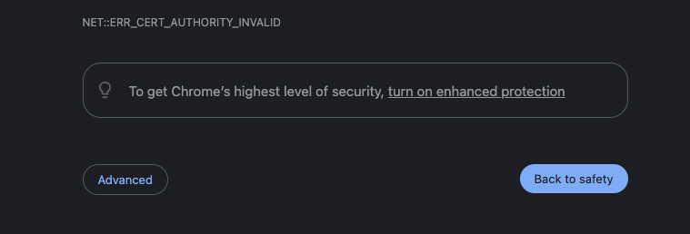

# RAG with Amazon Bedrock and PGVector on Amazon RDS

Opinionated sample on how to configure and deploy [RAG (Retrieval Augmented Generation)](https://research.ibm.com/blog/retrieval-augmented-generation-RAG) application.

It is comprised of a few core pieces:

* [Amazon Bedrock](https://aws.amazon.com/bedrock/) as the managed service providing easy API based access to [foundation models (FMs)](https://aws.amazon.com/what-is/foundation-models/).

* [Amazon Relational Database Service (RDS)](https://aws.amazon.com/rds/) + [PGVector](https://github.com/pgvector/pgvector) as a Vector database. This is an open-source alternative to using [Amazon Kendra](https://aws.amazon.com/kendra/).

* [LangChain](https://www.langchain.com/) as a [Large Language Model (LLM)](https://www.elastic.co/what-is/large-language-models) application framework. It has also been used to update PGVector when new documents get added to the knowledgebase S3 bucket.

* [Amazon Elastic Container Service (ECS)](https://aws.amazon.com/ecs/) to run the RAG Application.

* [Streamlit](https://streamlit.io/) for the frontent user interface of the RAG Application.

* [Application Load Balancer](https://aws.amazon.com/elasticloadbalancing/application-load-balancer/) to route HTTPS traffic to the ECS service (which is running the RAG App).

* [Amazon Cognito](https://aws.amazon.com/cognito/) for secure user authentication.

## Architecture


## Short note on vector data stores

[Vector database](https://en.wikipedia.org/wiki/Vector_database) is an essential component of any RAG application. The LLM framework uses the vector data store to search for information based on the question that comes from the user. 

Typical assumption (*and a strong constraint on this sample project*) is that a knowledgebase would comprise of PDF documents stored somewhere. Ideally, a true knowledgebase would encompass a lot more - would scrape websites, wiki pages and so on. But to limit the scope of this sample, the knowledgebase is an [S3](https://aws.amazon.com/s3/) bucket containing a bunch of PDF documents.

A popular choice for vector database in an AWS based RAG app is Amazon Kendra. It does [optical character recognition (OCR)](https://en.wikipedia.org/wiki/Optical_character_recognition) for PDFs under the hood. It is a fully managed search service with seemless integration with AWS Services like S3. Additionally, Amazon Bedrock also has a vector database offering in the form of ["Knowledgebases"](https://aws.amazon.com/bedrock/knowledge-bases/). 

NOTE - "Bedrock Knowledgebases" is another vector store offering; and **it should not** be confused with the term "knowledgebase" and/or "knowledgebase bucket" which refers to the S3 bucket containing PDF documents in this project.

However, the purpose of this sample was to show how to set up an open-source vector database, and since Kendra and Bedrock Knowledgebases are not open source, this sample is focusing on PGVector (*running on Amazon RDS*). Unlike Kendra, PGVector cannot directly query PDF documents, so we need to extract the text, and then feed the text to PGVector.

## PGVector orchestration

The expectation is that PDF files will land in the knowledgebase S3 bucket - either by manually uploading it via the console, or programmatically via the [AWS CLI](https://aws.amazon.com/cli/) or by running `cdk deploy BaseInfraStack`. NOTE - the last option (*`cdk deploy`*) requires that you put the PDF files in the ["knowledgebase"](./knowledgebase/) directory of this project. The [S3 Bucket Deployment](https://docs.aws.amazon.com/cdk/api/v2/docs/aws-cdk-lib.aws_s3_deployment.BucketDeployment.html) construct will then upload these files to the knowledgebase bucket.

Once the files land in the knowledgebase S3 bucket, [S3 Event Notifications](https://docs.aws.amazon.com/AmazonS3/latest/userguide/EventNotifications.html) initiate a [lambda](https://docs.aws.amazon.com/lambda/latest/dg/welcome.html) function to extract text from the PDF file(s), and upload the converted text files into the "processed text S3 Bucket". The code/logic for this conversion [lambda function](./lambda/pdf-processor/lambda_function.py) is in the [lambda/pdf-processor](./lambda/pdf-processor/) directory. The function uses the [pypdf](https://github.com/py-pdf/pypdf) Python Library to achieve the text extraction.

After the processed text files land in the "processed text S3 bucket", another S3 Event Notification triggers another lambda function ([pgvector-trigger](./lambda/pgvector-trigger/app.py)) that extract the necessary information about the file and pushes it off to an [Amazon SQS](https://aws.amazon.com/sqs/) queue. 

That message push in the SQS, initiates another lambda function ([pgvector-update](./lambda/pgvector-update/app.py)) that finally updates the vector database with the contents of the processed text file to be indexed (*which will enable it to be searched by the RAG app*). This lambda function uses LangChain to [add documents to PGVector](https://python.langchain.com/docs/integrations/vectorstores/pgvector#add-documents). Additionally it uses the [S3FileLoader](https://python.langchain.com/docs/integrations/document_loaders/aws_s3_file) component from LangChain to extract document contents to feed PGVector.

### Short note on Embeddings

[Embeddings](https://www.elastic.co/what-is/vector-embedding) are a way to convert words and sentences into numbers that capture their meaning and relationships. In the context of RAG, these "vector embeddings" aid in ["similarity search"](https://en.wikipedia.org/wiki/Similarity_search) capabilities. Adding documents to PGVector also requires creation/provisioning of embeddings. This project/sample has utilized [OpenAI's Embeddings](https://platform.openai.com/docs/guides/embeddings). So, if you wish to build/run this app in your own AWS environment, you would need to create an account with OpenAI and need their [API Key](https://help.openai.com/en/articles/4936850-where-do-i-find-my-api-key). 

**OpenAI has its own pricing on its API usage** so be mindful of that. You can find that out on their [pricing page](https://openai.com/pricing). You should be able to get going with the free credits, but if you keep this app running long enough, it will start accruing additional charges.

Some other options to obtain embeddings - 
* [HuggingFace](https://huggingface.co/blog/getting-started-with-embeddings)
* [Amazon Titan](https://aws.amazon.com/about-aws/whats-new/2023/09/amazon-titan-embeddings-generally-available/)

NOTE - If you wish to use alternative embeddings, you will need to change the code in the [rag-app](./rag-app/) and the [pgvector-update lambda function](./lambda/pgvector-update/) accordingly.

## Deploying the app

This project is divided into a few sub-stacks, so deploying it also requires a few additional steps. It uses [AWS CDK](https://aws.amazon.com/cdk/) for [Infrastructure as Code (IaC)](https://en.wikipedia.org/wiki/Infrastructure_as_code). 

### Pre-requisites

* Since this is a [TypeScript](https://www.typescriptlang.org/) CDK project, you should have [npm](https://www.npmjs.com/) installed (which is the package manager for TypeScript/JavaScript).
    * You can find installation instructions for npm [here](https://docs.npmjs.com/downloading-and-installing-node-js-and-npm).

* Install [AWS CLI](https://aws.amazon.com/cli/) on your computer (*if not already done so*).
    *  `pip install awscli`. This means need to have python installed on your computer (if it is not already installed.)
    * You need to also configure and authenticate your AWS CLI to be able to interact with AWS programmatically. Detailed instructions of how you could do that are provided [here](https://docs.aws.amazon.com/cli/latest/userguide/cli-chap-configure.html)

* You  need to have [docker](https://www.docker.com/) installed on your computer.
    * You can check out these options for building and running docker containers on your local machine:
        * [Docker desktop](https://www.docker.com/products/docker-desktop/). Most popular container management app. Note - it does require a license if the organization you work at is bigger than a certain threshold.
        * [Rancher desktop](https://rancherdesktop.io/). It is a popular open source container management tool.
        * [Finch](https://github.com/runfinch/finch). Another open-source tool for container management.Note - currently it only supports MacOS machines.

* Have an API Key from [OpenAI](https://openai.com/). This key is needed for programmatic access to use their embeddings for PGVector. You need to create an account with OpenAI (*if you already don't have one already*). Details to find/create an API Key can be found [here](https://help.openai.com/en/articles/4936850-where-do-i-find-my-api-key).

### Create a self-signed SSL certificate

* Set the `IAM_SELF_SIGNED_SERVER_CERT_NAME` environment variable. This is the name of the self-signed server certificate that will be created ([via IAM](https://docs.aws.amazon.com/IAM/latest/UserGuide/id_credentials_server-certs.html)) as part of the deployment. 

    ```
    export IAM_SELF_SIGNED_SERVER_CERT_NAME=<name you want to give to your ssl cert>
    ```

* Run the [self-signed-cert-utility.py](./scripts/self-signed-cert-utility/self-signed-cert-utility.py) script in the [scripts](./scripts/) directory to create a self-signed certificate, and upload its contents to AWS via `boto3` API calls.

This is needed because the Application Load Balancer requires [SSL certificates](https://www.cloudflare.com/en-gb/learning/ssl/what-is-an-ssl-certificate/) to have a functioning [HTTPS listener](https://docs.aws.amazon.com/elasticloadbalancing/latest/application/create-https-listener.html). 

    ```
    # switch to the self-signed-cert-utility directory
    cd scripts/self-signed-cert-utility

    # create a python3 virtual environment (highly recommended)
    python3 -m virtualenv .certenv

    # activate the virtual environment
    source .certenv/bin/activate
    # for a different shell like fish, just add a `.fish` at the end of the previous command

    # install requirements
    pip install -r requirements.txt

    # run the script
    python self-signed-cert-utility.py
    # optionally specify a `--profile` if you're not using the default AWS profile

    # deactivate virtual environment
    deactivate

    # return to the root directory of the project
    cd -
    ```

If the script runs successfully, you should see a a JSON like object printed out in the log output with parameters like `ServerCertificateName`, `ServerCertificateId`, `Arn` etc. Moreover, the `HTTPStatusCode` should have the value `200`.

The parameters encoded in the certificate are in a JSON file. By default it expects a file named ["default_cert_parameters.json"](./scripts/self-signed-cert-utility/default_cert_params.json) unless otherwise specified. You may change the values of the default JSON file if you wish to. If you wish to use your own config file (*instead of the default*), you can do so by specifying the `--config-file` parameter.

You can also specify a custom domain for the certificate by setting the `APP_DOMAIN` environment variable.

NOTE - an alternative would be to use the [AWS Certificates Manager](https://aws.amazon.com/certificate-manager/) but it requires additional steps (*in the form of creating and registering your own domain, involve [Route53 hosted zones](https://docs.aws.amazon.com/Route53/latest/DeveloperGuide/hosted-zones-working-with.html) etc*). And since the focus of this sample is to show deployment of a RAG app, and not registering domains etc. it does not get into configuring that bit.


### Define the domain name for the Cognito hosted UI

Set the `COGNITO_DOMAIN_NAME` environment variable. This will be the domain of the [Cognito hosted UI](https://docs.aws.amazon.com/cognito/latest/developerguide/cognito-user-pools-app-integration.html) which will be used to "log-in" and/or "sign-up" into the app.
```
export COGNITO_DOMAIN_NAME=<name you want to give to your cognito hosted ui domain>
```

### Install dependencies (if not already done)

```
npm install
```

### Set environment variable (if you are on an M1/M2 Mac)

Depending on the architecture of your computer, you may need to set this environment variable for the docker container. This is because docker containers are dependent on the architecture of the host machine that is building/running them.

**If your machine runs on the  [x86](https://en.wikipedia.org/wiki/X86) architecture, you can ignore this step.**

```
export DOCKER_CONTAINER_PLATFORM_ARCH=arm
```


### Deploy the BaseInfraStack

```
npx cdk deploy BaseInfraStack

# You can optionally specify `--profile` at the end of that command if you wish to not use the default AWS profile.
```

This will deploy the base infrastructure - consisting of a VPC, Application Load Balancer for the app, S3 buckets (for knowledgebase, and the processed text), Lambda functions to process the PDF documents, some SQS queues for decoupling, a Secret credential for the OpenAI API key, Cognito user pool and some more bits and pieces of the cloud infrastructure. The CDK code for this is in the [lib](./lib) directory within the [base-infra-stack.ts](./lib/base-infra-stack.ts) file.

### Upload the OpenAI API key to Secrets Manager

The secret was created after the deployment of the `BaseInfraStack` but the value inside it is not valid. You can either enter your OpenAI API key via the AWS Secrets Manager console; Or you could use the [api-key-secret-manager-upload.py](./scripts/api-key-secret-manager-upload/api-key-secret-manager-upload.py) script to do that for you.

[AWS Secrets Manager](https://aws.amazon.com/secrets-manager/) is the recommended way to store credentials in AWS, as it provides API based access to credentials for databases etc. Since OpenAI (*the provider we are using the vector emebeddings from*) is an external service and has its own API keys, we need to manually upload that key to Secrets Manager so that the app infrastructure can access it securely.

    ```
    # switch to the api-key-secret-manager-upload directory
    cd scripts/api-key-secret-manager-upload

    # create a python3 virtual environment (highly recommended)
    python3 -m virtualenv .keyenv

    # activate the virtual environment
    source .keyenv/bin/activate
    # for a different shell like fish, just add a `.fish` at the end of the previous command

    # install requirements
    pip install -r requirements.txt

    # run the script; optionally specify a `--profile` if you're not using the default AWS profile
    python api-key-secret-manager-upload.py.py -s openAiApiKey

    2024-01-14 19:42:59,341 INFO  [__main__]:[MainThread] AWS Profile being used: frgtest
    2024-01-14 19:42:59,421 INFO  [__main__]:[MainThread] Updating Secret: openAiApiKey
    Please enter the API Key:
    2024-01-14 19:44:02,221 INFO  [__main__]:[MainThread] Successfully updated secret value
    2024-01-14 19:44:02,221 INFO  [__main__]:[MainThread] Total time elapsed: 62.88090920448303 seconds
    # deactivate virtual environment
    deactivate

    # return to the root directory of the project
    cd -
    ```

The script will prompt you to enter you OpenAI API key. It uses the [getpass](https://docs.python.org/3/library/getpass.html) Python library so that you don't have to enter it in plain text.

NOTE - that the instructions specify `-s openAiApiKey`. It is the same name as defined in the [base-infra-stack.ts](./lib/base-infra-stack.ts?plain=1#L164). If you change the value there, you will need to change the value whilst running the script too.

### Deploy the RDS Stack

```
npx cdk deploy rdsStack

# You can optionally specify `--profile` at the end of that command if you wish to not use the default AWS profile.
```

This will deploy an Amazon RDS instance in a private subnet of the VPC that was deployed as part of the "BaseInfraStack", and some security group (*and their associated egress and ingress rules*) The CDK code for the "rdsStack" is in the [rds-stack.ts](./lib/rds-stack.ts) file in the [lib](./lib/) directory.

NOTE - you can also use [Amazon Aurora Serverless V2 (PostgreSQL)](https://docs.aws.amazon.com/AmazonRDS/latest/AuroraUserGuide/aurora-serverless-v2.html) for PGVector. More details can be found [here](https://aws.amazon.com/about-aws/whats-new/2023/07/amazon-aurora-postgresql-pgvector-vector-storage-similarity-search/).

The reason to not use Aurora Serverless was to also demonstrate [running Lambda functions in a VPC](https://docs.aws.amazon.com/lambda/latest/dg/configuration-vpc.html), and interacting with a database in a private subnet.

### Deploy the DDL Source Stack

```
npx cdk deploy ddlSourceStack

# You can optionally specify `--profile` at the end of that command if you wish to not use the default AWS profile.
```
This will deploy an S3 Bucket that contains a DDL file (in this project's case, it is the [rds-ddl.sql](./scripts/rds-ddl-sql/rds-ddl.sql) in the [scripts](./scripts/) directory) via the S3 Bucket Deployment CDK construct.

This is needed because the RDS instance that gets deployed does not have the PGVector extension (*it needs to be installed seprately*). The command is as simple as `CREATE EXTENSION vector;`. 

To avoid manually installing anything, the automation mechanism inspired from this [open-source project/sample](https://github.com/aws-samples/ddl-deployment-for-amazon-rds), was employed in this solution. The architecture of that automation pattern can be found [here](./architecture/ddl_automation_arch.png). 

Note that the sample used Aurora Serverless V1 (*instead of an RDS instance*). That version had access to the [RDS Data API](https://docs.aws.amazon.com/AmazonRDS/latest/AuroraUserGuide/data-api.html). So this project's Lambda function(s) interacting with the database are running in a VPC as the database is in a private subnet without exposing any data API. Additionally, the lambda function(s) use the [psycopg2](https://pypi.org/project/psycopg2/) Python library to run queries against the database.

The CDK code for the "ddlSourceStack" is in the [ddl-source-rds-stack.ts](./lib/ddl-source-rds-stack.ts) file in the [lib](./lib/) directory.

### Deploy the RDS DDL Automation Stack

```
npx cdk deploy ddlAutomationStack

# You can optionally specify `--profile` at the end of that command if you wish to not use the default AWS profile.
```
This will deploy some lambda function(s) to orchestrate automatically initializing the RDS instance with the DDL SQL file (as part of the automation mechanism mentioned in the previous section). The architecture of that automation pattern can be found [here](./architecture/ddl_automation_arch.png).

It features 2 lambda functions -
* one that initializes the RDS Instance upon creation (*with the DDL SQL statements*). The code/logic for that function is in the [lambda/rds-ddl-init](./lambda/rds-ddl-init/) directory.
* another that executes the DDL statements when there is a change to the DDL SQL file. The code/logic for that function is in the [lambda/rds-ddl-change](./lambda/rds-ddl-change/) directory

The CDK code for the "ddlAutomationStack" is in the [rds-ddl-automation-stack.ts](./lib/rds-ddl-automation-stack.ts) file in the [lib](./lib/) directory.

### Deploy the PGVector Update Stack

```
npx cdk deploy PGVectorUpdateStack

# You can optionally specify `--profile` at the end of that command if you wish to not use the default AWS profile.
```

This will deploy the lambda function which is responsible for updating the PGVector data store whenever there is a new document in the "processed text S3 Bucket". It leverages LangChain to do this operation. The code/logic for that lambda function is in the [lambda/pgvector-update](./lambda/pgvector-update/) directory.

The CDK code for the "PGVectorUpdateStack" is in the [pgvector-update-stack.ts](./lib/pgvector-update-stack.ts) file in the [lib](./lib/) directory.

### Deploy the RAG App Stack

```
npx cdk deploy RagStack

# You can optionally specify `--profile` at the end of that command if you wish to not use the default AWS profile.
```

This will deploy the ECS Fargate service running the code for the RAG Application. It will also add this service as a target to the Application Load Balancer defined in the "BaseInfraStack". The CDK infrastructure code for this stack is in the [rag-app-stack.ts](./lib/rag-app-stack.ts) file in the [lib](./lib/) directory.

This app leverages LangChain for interacting with Bedrock and PGVector; and Streamlit for the frontend user interface. The application code is in the [rag-app](./rag-app/) directory. 

### [Optional] Deploy the TestCompute Stack

```
npx cdk deploy TestComputeStack

# You can optionally specify `--profile` at the end of that command if you wish to not use the default AWS profile.
```

This will deploy an EC2 instance capable of connecting to the RDS instance.

This is optional. Since our RDS instance does not provide a query interface through the AWS console, it can be useful to have a Bastion EC2 host to interact with it, and maybe also test out some more LangChain functionality. Note - the EC2 instance is pretty bare bones, so you will need to install the necessary packages to be able to connect to the RDS instance and/or do anything else. 

### Add some PDF documents to the knowledgebase S3 Bucket

After deploying the "RagStack", the necessary infrastructure to have the app running is complete. That being said, you need to still populate the knowledgebase S3 bucket. 

You can either do it manually by going into the console and uploading some files.

Or you can add some PDF files to the [knowledgebase](./knowledgebase/) directory in this project, and then run `npx cdk deploy BaseInfraStack`. The reason to prefer this option would be that you can then track knowledgebase documents in your source control (*if that is a requirement for your use case*).

This should upload the document(s) to the Knowledgebase S3 bucket via the S3 Bucket Deployment construct.

After the upload to the S3 knowledgebase bucket is complete, it will trigger the [pdf-processor](./lambda/pdf-processor/) lambda function to extract the text from the PDF and upload it to the "processed text s3 bucket".

Upload to the processed text bucket will trigger the [pgvector-update](./lambda/pgvector-update/) lambda function to then add that document to the PGVector (*on RDS*) data store. 
You can verify that it has been added to the vector store by a couple of different ways:
* Check the logs of the lambda function; if there are no errors, the document has probably successfully been indexed in PGVector.
* However, to be certain, you can connect to the RDS instance via a Bastion Host(*the TestCompute Stack might come in handy here*):

```
# install postgresql (if not done already)
sudo apt install postgresql

# grab the connection details from the secrets manager, and then run 
psql -h <RDS_HOST_NAME> -U postgres

# enter the DB password when prompted
Password for user postgres:

# after connecting, run the following SQL query
postgres=> SELECT * FROM langchain_pg_collection;

# it should spit out a name, and a uuid ; 
# the name should be something like `pgvector-collection-..`
# run the following SQL
postgres=> SELECT uuid, COUNT(*) FROM langchain_pg_embedding WHERE collection_id = '<UUID_FROM_THE_ABOVE_QUERY>' GROUP BY 1;

# if the count is not 0 (i.e. a positve integer), that means the collection with the embedding has been addded successfully
```

### Testing the RAG App

After adding document(s) to the knowledgebase, you can now test the app. 

If you log into the AWS console, and find the Application Load Balancer (*under the EC2 section*) page, and select the load balancer that was created as part of the "BaseInfraStack", it should have a "DNS name". If you copy that name, and type `https://<DNS_NAME>` in your browser, it should direct you to the app.

Note - since we are using a self-signed SSL certificate (*via IAM Server Certificates*), you might see this warning on your browser (showing Chrome below):



If you see that warning, click on advanced, and proceed to the URL, it should then direct you to the Login UI (*server via Cognito*):


* You can either click sign-up and create a new user from this console (*note - you will have to verify the email you sign up with by entering the code that gets sent to that email*)

* Alternatively you could create a user in the AWS Console (by navigating to the cognito service)

* There is a programmatic way to create your user via the SDK; or you could use this [open-source helper utility](https://github.com/aws-samples/cognito-user-token-helper).

Once you've successfully signed in (*or signed up*), you will see the UI, and you can start asking questions based on the document(s) you've uploaded. The example document used is the [2021 Amazon letter to the shareholder](https://www.aboutamazon.com/news/company-news/2021-letter-to-shareholders), and the question asked was "What is AWS?":


## Miscellaneous notes / technical hiccups / recommendations 

* The **frontend user interface (UI)** was built using streamlit, and inspired by another [open source project](https://github.com/aws-samples/amazon-kendra-langchain-extensions/tree/main/kendra_retriever_samples).

* **Cognito Callback URL hiccup** - 
When creating an application load balancer via Infrastructure as Code (IaC), the DNS name is generated with some random characters (*that can be both UPPER CASE and lower case*). When configuring this with the Cognito User Pool Integration (*app client*), the DNS name is used for the Callback URL. The problem here is that Cognito does not like UPPER CASE characters, and whilst deploying this solution via IaC, there isn't much you can do about converting the DNS name to lower case (*because it is actually a token, and not the actual string value of the DNA name*). There is an [open Github issue](https://github.com/aws/aws-cdk/issues/11171) on this. 

    So, in order to fix this, the project has Eventbridge triggers in place, that check for when the App integration client is created, a lambda function is invoked that pushes a message to an SQS queue, which invokes another  Lambda function that updates the app client via the [update_user_pool_client](https://boto3.amazonaws.com/v1/documentation/api/latest/reference/services/cognito-idp/client/update_user_pool_client.html) boto3 API call with the lower case DNS name in the callback URL. 

    The code for the lambda function is in the [lambda/call-back-url-init](./lambda/call-back-url-init/) directory.

* If you were to **deploy a solution like this in a production environment**, you would need to create and register your own domain to host the app. The recommendation would be to use **AWS Certificates Manager** to generate the self signed certificate, and link that with a **Route53 hosted zone**. More details can be found in [AWS Documentation](https://docs.aws.amazon.com/acm/latest/userguide/dns-validation.html).

* While streamlit is good for quickly deploying UIs, it may not be best suited for production if the intent is to add more functionality to the app (*i.e. extending it beyong the RAG Chatbot app*). It may be worth looking at [AWS Amplify](https://aws.amazon.com/amplify). Decoupling the frontend from the backend could also introduce the possibility of running the backend as a Lambda Function with API Gateway.

* Alternate vector embedding providers like HuggingFace and/or Amazon Titan would require some code changes (*specifically in the Lambda function(s) that update PGVector via LangChain, and the ECS application running the RAG app*).

* The model used in this sample is [Anthropic's Claude V1 Instant](https://aws.amazon.com/bedrock/claude/). You can change the model by providing an environment variable `FOUNDATION_MODEL_ID` to the rag app in the [rag-app-stack.ts](./lib/rag-app-stack.ts?plain=1#L143). You can find the different model IDs on the [AWS Documentation](https://docs.aws.amazon.com/bedrock/latest/userguide/model-ids-arns.html)

* Key concepts / techniques covered in this sample - 
    * PGVector as an Open source Vector database option for RAG applications
    * Running Lambda functions in VPCs to interact with RDS databases in private subnet(s)
    * Using LangChain to serve a RAG application, update PGVector
    * Application Load Balancer (ALB) + ECS Fargate Service to serve an app
    * Using self signed certificates to configure the HTTPS listener for the ALB
    * Integrating a Cognito Login UI with the ALB

## Generic CDK instructions

This is a blank project for CDK development with TypeScript.

The `cdk.json` file tells the CDK Toolkit how to execute your app.

## Useful commands

* `npm run build`   compile typescript to js
* `npm run watch`   watch for changes and compile
* `npm run test`    perform the jest unit tests
* `cdk deploy`      deploy this stack to your default AWS account/region
* `cdk diff`        compare deployed stack with current state
* `cdk synth`       emits the synthesized CloudFormation template
